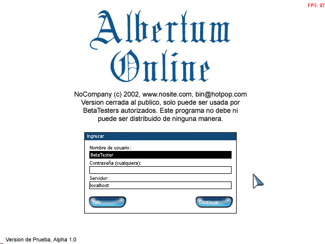
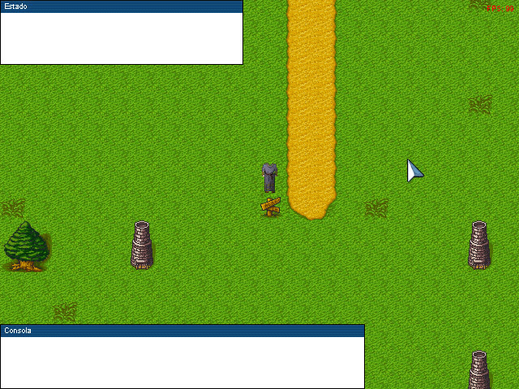

# Albertum
Tile-based RPG (discontinued in 2002, when I was 16)

Before finishing high school I was really into Game Development.
In this case, I wanted to learn DirectX and create a small tile-based RPG.
Actually, I wanted to have a few maps and a guy moving around.

The code was basically made from scratch, with the ocassional help of some online tutorials. It includes:
* A map loader and renderer
* A window system with quite some nice widgets
* Basic bitmap character animation
* Loading and management of images, bitmap fonts, sound and textures

_Note: Pardon the notation and lack of "modern" design patterns in the code. This was ages ago. My dial-up connection really limited my learning ;)_

## Screenshots

